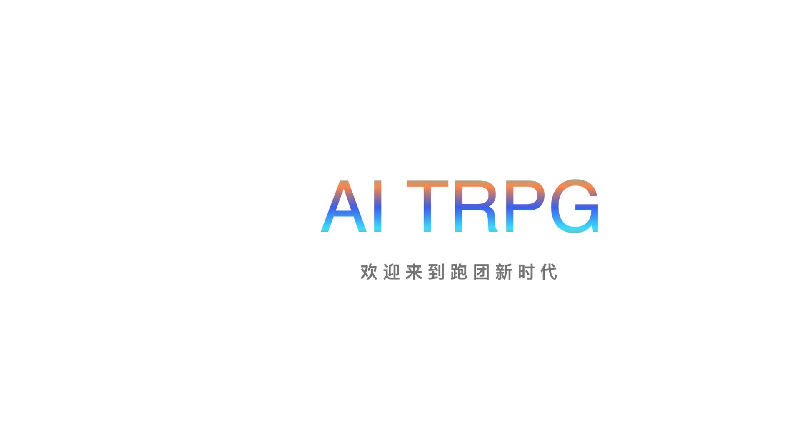
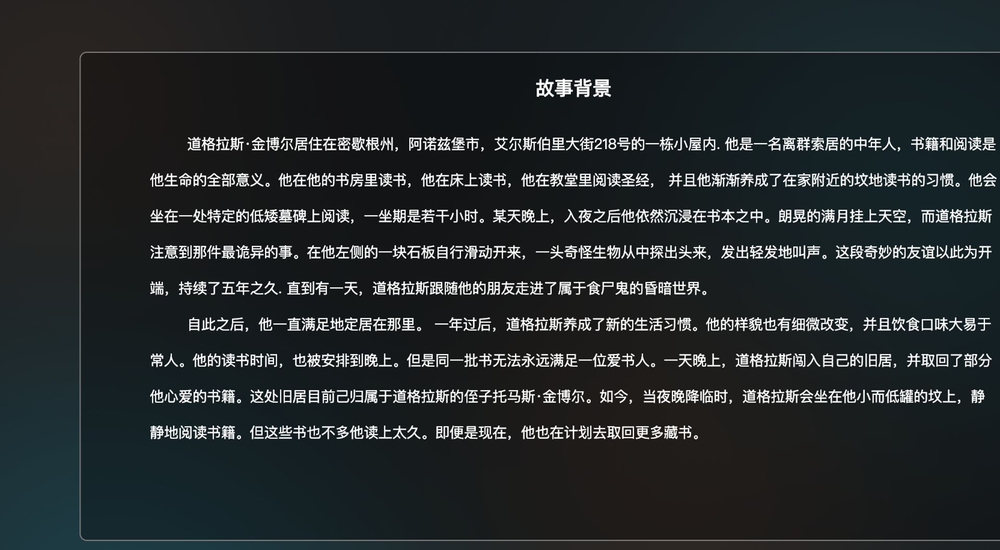
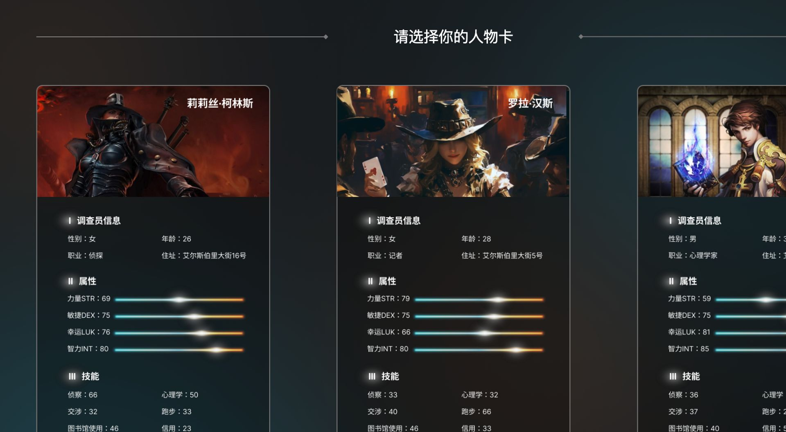
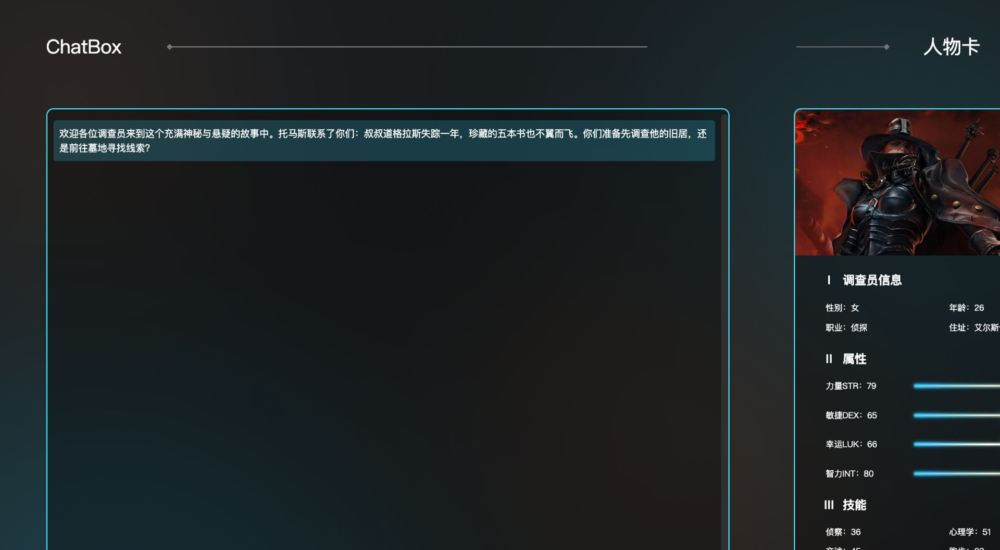
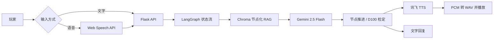

# AI-TRPG ｜ 语音驱动的 AI 跑团游戏

> 让 AI 成为会听、会说、会控场的跑团主持人。


AI-TRPG 是一款中文语音交互的单人 TRPG 原型。玩家选择调查员角色后，可通过文字或语音自由探索剧情；AI DM 会根据当前剧情节点检索剧本、生成 NPC 回应、触发属性检定，并将回复转换为语音播放。



## 为什么做这个项目

传统 TRPG 需要玩家理解较多规则，同时高度依赖经验丰富的 DM。这个项目尝试用 AI 降低两个门槛：

- 用自然语言代替复杂指令，让新手也能直接表达行动。
- 用节点化 RAG 和 Agent 工作流承接 DM 的叙事、问答与控场职责。
- 通过语音输入与语音播报增强沉浸感，减少长文字交互的负担。

## 核心体验

| 能力 | 说明 |
| --- | --- |
| AI DM 对话 | Gemini 根据玩家行动即时生成叙事、NPC 台词与行动提示 |
| 剧情节点控制 | 7 个剧情节点通过显式状态推进，避免大模型跳关或过早透露结局 |
| 剧本 RAG | 按“节点”切分 DOCX/PDF 剧本，使用 Chroma 进行当前节点优先的语义检索 |
| 角色与检定 | 3 张人物卡、4 项核心属性与 6 项技能，支持 D100 属性检定 |
| 中文语音交互 | 浏览器 Web Speech API 负责语音转文字，讯飞 WebAPI TTS 负责回复播报 |
| 多结局叙事 | 玩家可通过交涉、对抗或追随做出不同抉择，对应 3 类结局 |

## 界面展示

| 世界观与任务导入 | 角色选择 |
| --- | --- |
|  |  |

### 核心对话界面

左侧为 AI DM 对话与操作区，右侧实时展示调查员属性和技能。玩家可使用文字、语音或掷骰子继续行动。



## 玩法流程

1. 阅读「道格拉斯·金博尔失踪与藏书被盗」的任务背景。
2. 从侦探、记者等调查员中选择角色，获取不同属性与技能。
3. 通过文字或中文语音询问 NPC、搜索场景、决定下一步行动。
4. 在关键节点进行 D100 检定，成功则获得线索并推进剧情，失败则转入备选路径。
5. 通过邻居访谈、公墓调查、图书馆检索与地穴探索接近真相。

## 技术架构



### 关键实现

- **节点化 RAG**：以“节点 N”作为剧本分割标记，为每个 chunk 写入 `level` 元数据。检索时优先限定当前节点，无结果时再回退至全局语义检索。
- **可控剧情推进**：模型完成节点目标后输出 `[ADVANCE_NODE]`，后端捕获标记并更新 `current_node`，防止无限发散与跳关。
- **对话状态管理**：基于 LangGraph 构建 `Agent ↔ AskHuman` 循环，使用 `MemorySaver` 和 `interrupt/resume` 保留多轮上下文。
- **语音链路**：前端完成中文语音识别，后端通过 WebSocket 获取 TTS PCM 流，转换为 WAV 后回传浏览器播放。
- **规则与生成结合**：AI 负责理解玩家意图和生成叙事，后端负责属性值、随机数与检定结果，保留桌面角色扮演的规则感。

## 技术栈

| 层级 | 技术 |
| --- | --- |
| 前端 | HTML5、CSS3、JavaScript、Web Speech API |
| Web 后端 | Flask、Jinja2、Gunicorn |
| LLM / Agent | Gemini 2.5 Flash、LangChain、LangGraph |
| 知识检索 | Gemini Embeddings、ChromaDB、RecursiveCharacterTextSplitter |
| 语音合成 | 讯飞 WebAPI TTS、WebSocket、PCM/WAV |
| 数据来源 | DOCX/PDF 剧本文档 |

## 本地运行

### 1. 环境要求

- Python 3.10
- 可用的 Google Gemini API Key
- 如需语音播报：讯飞开放平台 WebAPI TTS 凭据
- 支持 Web Speech API 的浏览器（建议 Chrome）

### 2. 安装

```bash
git clone https://github.com/2872621359/Demo--RPG.git
cd Demo--RPG

python3.10 -m venv .venv
source .venv/bin/activate  # Windows: .venv\Scripts\activate
pip install -r requirements.txt
```

### 3. 配置密钥

```bash
cp .env.example .env
```

编辑 `.env`：

```dotenv
GEMINI_API_KEY=your_gemini_api_key
XFYUN_APPID=your_xfyun_appid
XFYUN_API_KEY=your_xfyun_api_key
XFYUN_API_SECRET=your_xfyun_api_secret
```

> 请勿将 `.env`、`api_keys.json` 或任何真实密钥提交到 Git 仓库。

### 4. 启动

```bash
python app.py
```

访问 [http://localhost:5003](http://localhost:5003)。首次启动会读取剧本、生成向量并初始化本地 Chroma 索引，因此需要等待片刻。

## 项目结构

```text
Demo--RPG/
├── app.py                  # Flask 路由、Agent、RAG、检定与 TTS 主流程
├── keda.py                # 讯飞 WebSocket TTS 封装
├── templates/             # 首页、世界观、角色选择与对话界面
├── css/                   # 界面样式
├── images/                # 背景与角色资源
├── static/audio/          # TTS 生成的音频文件
├── document/              # 剧本知识库
├── docs/screenshots/      # README 演示截图
├── requirements.txt
└── .env.example
```

## 个人项目工作

本项目覆盖从需求到原型落地的完整过程：

- 完成市场、用户与竞品调研，定义“低门槛 + 语音沉浸 + AI DM”的产品方向。
- 拆解世界观、人物卡、剧情节点、属性检定与多结局路径。
- 完成交互原型、前端页面、Flask 后端、RAG 知识库和 Agent 工作流的集成。
- 设计并打通 STT → LLM → TTS 的端到端语音交互链路。
- 通过用户试玩反馈验证语音输入、剧情边界和新手引导方案。

## 当前状态与后续计划

本项目当前为用于验证核心体验的 **Prototype**，已跑通单人剧情、节点 RAG、检定与语音回复链路。后续计划包括：

- 将全局对话状态拆分为独立会话，支持多用户与存档。
- 支持用户上传自定义模组，自动识别剧情节点并构建知识库。
- 引入流式生成与异步 TTS，降低长回复的等待时间。
- 补充移动端适配、语音识别降级策略、自动化测试与可观测性。

## 说明

本仓库为个人作品集项目，主要用于展示 AI 产品设计、LLM 应用开发与语音交互实践。
